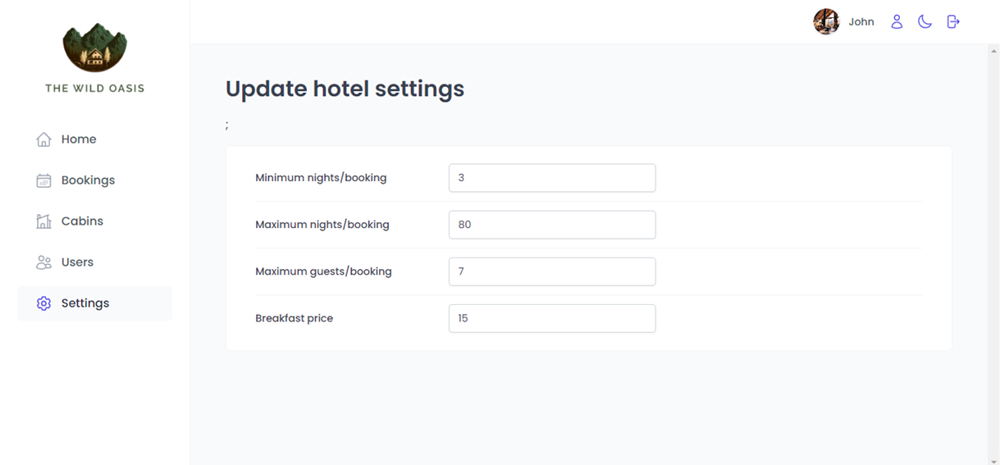

## Project Requirements

- Users of the app are hotel employees. They need to be logged into the application to perform tasks.
- New users can only be signed up inside the application (to guarantee that only actual hotel employees can get accounts).
- Users should be able to upload an avatar, and change their name and password.
- App needs a table view with cabins, showing the cabin photo, name, capacity, price and current discount.
- Users should be able to update or delete a cabin, and to create new cabins (including uploading a photo).
- App needs a table view with all bookings, showing arrival and departure dates, status, and paid amount, as well as cabin and guest data.
- The booking status can be "unconfirmed" (booked but not yet checked in), "checked in" or "checked out". The table should be filterable by this important status.
- Other booking data includes: number of guests, number of nights, gest observations, whether they booked breakfast, breakfast price.
- Users should be able to delete, check in, or check out a booking as the guest arrives.
- Bookings may not have been paid yet on guest arrival. Therefore, on check in, users need to accept payment (outside the app), and then confirm that payment has been received (inside the app).
- On check in, the guests shoul have the ability to add breakfast for the entire stay, if they hadn't already.
- Guest data should contain: full name, email, national ID, nationality, and country flag for easy indentification.
- The initial app screen should be a dashboard, to display important information for the last 7, 30 or 90 days:
  1. A list of guests checking in and out on the current day. Users should be able to perform these tasks from here.
  2. Statistics on recent bookings, sales, check ins, and occupancy rate.
  3. A chart showing all daily hotel sales, showing both "total" sales and "extras" sales (only breakfast at the moment).
  4. A chart showing statistics on stay durations, as this is an important metric for the hotel.
- Users should be able to define a few application-wide settings: breakfast price, min and max nights/booking, max guests/booking.

## Tech Stack

- React project with Vite.
- React-Router, Context, Form validation.
- Backend with Supabase.
- Remote state management with React Query.
- Form management with React Hook Form.
- Styled-components.
- Other tools: React icons, React hot toast, Recharts, date-fns.

## Deployment

The project was deployed using Vercel.

- [Around The World in Vercel](https://around-the-world-eight.vercel.app/)

## Usage

To run the project locally follow the next steps:

1. Clone the project: `git clone https://github.com/JulianaCotabarren/Around-The-World`

2. Go to the project directory: `cd around-the-world`

3. Install dependencies: `npm install`

4. Run the app in the development mode: `npm run dev`

5. Open [http://localhost:3000](http://localhost:3000) to view it in the browser

6. Login with _email: johndoe@email.com_ and _password: 12345678_

## Website Images

